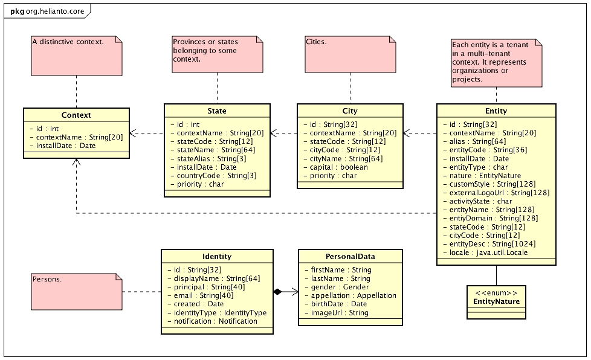
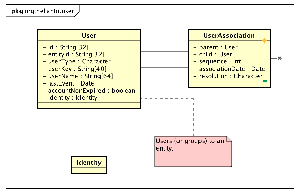
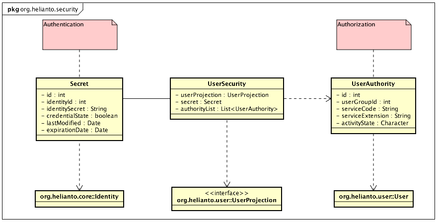

# helianto-spring

Helianto Spring service.

## Overview

Helianto Spring is the KaaS Ecosystem Provider IAM - Identity and Access
 Management. Once Helianto Spring - HSP for short - is added to any micro service
 orchestration tool, it will be ready to 1) keep identities, 2) relate them to 
 entities and 3) represent such combination as users, each user having 
 specific 4) authorities applicable to the owning entity. All of the above 
 constitute a context. More than one HSP may exist in the same micro service
 environment, but each one should have a distinct context name.
 
  
  
  
  
  
  
## Installation

The easiest way to install HSP is downloading a docker container:

```
 docker pull iservport/helianto-spring
```

You can configure your microservice environment to accept the downloaded 
 image, or run it locally:

```
 docker run -d -p 8081:8081 iservport/helianto-spring:latest
```

## Configuration

Here is a sample configuration file ```application.yaml```:

```
spring:
# Profiles
  profiles:
    active: dev
  freemarker:
    template-loader-path: classpath:/templates/
    prefer-file-system-access: false

# Helianto
helianto:
  contextName: DEFAULT
  root:
    system:
      ADMIN: READ,WRITE
      USER: READ
  user-token-validity: 5
  password:
    initial: 123456
    install: h3l1@nt0
  welcome:
    brandName: Helianto
    logo: /images/logo.png
    copyright: i-serv Consultoria Empresarial Ltda. 2004-2016
    inLineCss: |
      h2,h3,h5,.footer {color: white;}
      .heliantoLogin {background-image: url('/images/photo-1434396505260-9ec0d6491795.jpeg');}
  mfa:
    # cell phone, one of required | none
    cellPhone: none
    service: totalVoice
  register:
    # define admin option, one of ALLOW | DENY | a domain name
    admin: allow
    # define principal type, one of EMAIL | PIN  - to be implemented: | PHONE | USERNAME
    principal: e-mail
    # pinMask: 999.999.999-99
    # public unique number may be required
    pun: required
    punMask: 99.999.999/9999-99
    contextDomain: helianto.org
    inLineCss: |
      h2,h3,h5,.footer {color: white;}
      .heliantoLogin {background-image: url('/images/photo-9240912-peq.jpg');}

key-store:
  password: changeme
# Logging
logging:
  level:
    org.helianto: INFO
    org.springframework.security: INFO
    org.helianto.message: DEBUG
```

The file above contains the defaults, but notice there is 
 a ```spring.profiles.active``` key pointing to ```dev```. The following 
 file will retain the development configuration ```application-dev.yaml```:
 
```
# Server
server:
  port: 8081

helianto:
  api:
    url: http://localhost:8081
  mailer:
    url: http://localhost:8082
    entityName: helianto.org
    service:
      serviceType: echo_mailer
      serviceName: sendConfirmation
      user: iservport
      password: NONE
    senderEmail: noreply@helianto.org
    senderFullName: Maurício Fernandes de Castro

spring:
# DATASOURCE (DataSourceAutoConfiguration & DataSourceProperties)
  datasource:
    driver-class-name: com.mysql.jdbc.Driver
    hikari:
      maximum-pool-size: 3
      connection-timeout: 10
    name: helianto
    password: helianto
    test-on-borrow: true
    test-on-return: false
    test-while-idle: true
    time-between-eviction-runs-millis: 5000
    url: jdbc:mysql://192.168.10.5:3306/helianto01?autoreconnect=true
    username: helianto
    validation-query: SELECT 1
# Spring Data JPA
  jpa:
    repositories:
      enabled: true
    database-platform: org.hibernate.dialect.MySQL5Dialect
    generate-ddl: true
    hibernate:
      ddl-auto: update
      naming-strategy: org.hibernate.cfg.DefaultNamingStrategy
    show-sql: false
# Json
  jackson:
    serialization-inclusion: non_null

# Logging
logging:
  level:
    org.helianto: INFO
    org.helianto.core: DEBUG
    org.helianto.message: DEBUG
```